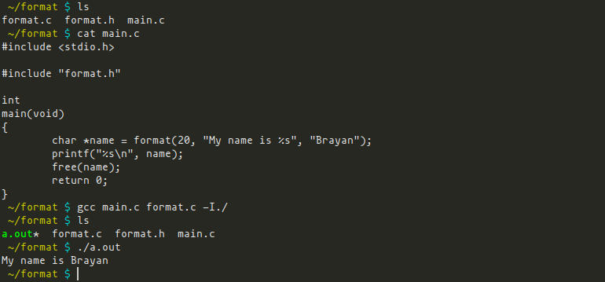

# format
Library for storing a formatted string, written in C.

This is a little library for storing formatted strings. This returns a freeable `char` array, so don't forget to free it!

To do that, this library makes use of the GNU printf's function technique and a bit of its own.

This is the function's prototype:

`char *format(size_t size, const char *fmt, ...);`

This stands for in the first place the size of the memory to be allocated,
this needs to be at least the minimum size of the whole string. The format and a list of arguments corresponding to the format.

For example, imagine you want to store the formatted string: `I am pepe and I am 27 years old.`

That string needs at least `32` bytes to be allocated. So, you can use this function to do that like:

```
char *info = format(32, "I am %s and I am %i years old.", "pepe", 27);
```

Another way to do that is by using auxiliary variables like:
```
char format[] = "I am %s and I am %i years old.";
size_t size   = strlen(format) + strlen("pepe");
char *info    = format(size, format, "pepe", 27);
```

Notice that I didn't allocate memory for `27` because it has enough memory because of `%s` and `%i` format specifiers.

To make use of this library you only need to save the `format.h` header in your project headers directory, wherever it is.

The `format.c` source file in your project sources directory, and include the `format.h` header whatever function you want to use it in.
And compile the `format.c` source file together the function which makes use of it.

Look at a graphical example:


This library doesn't pretend to be the best in the world, though. You'll use it if you find it useful, otherwise not, period.
